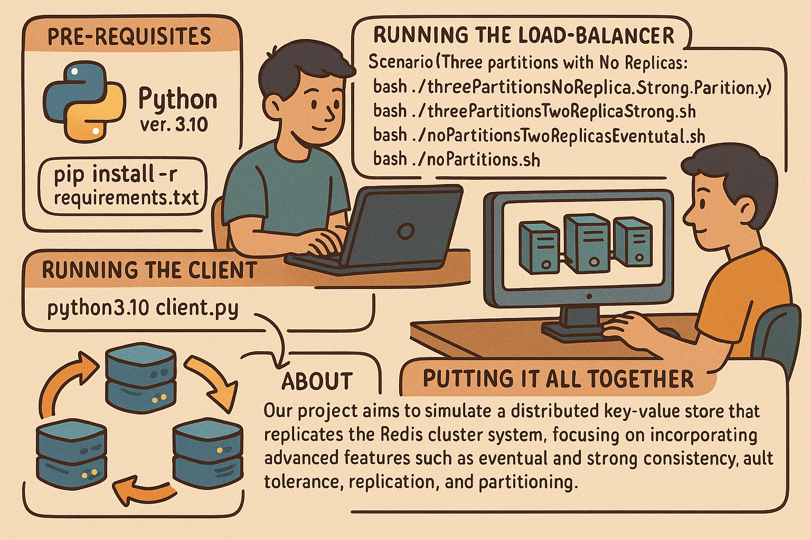

## Pre-requisites

  

- python version: 3.10
- `pip install -r requirements.txt`
## Running the load-balancer
- `cd launchScripts`
- Scenario (Three partitions with No Replicas) `bash ./threePartitionsNoReplica.sh`
- Scenario (Three partitions with Two Replicas - Strong consistency) `bash ./threePartitionsTwoReplicaStrong.sh`
- Scenario (Three partitions with Two Replicas - Eventual consistency) `bash ./threePartitionsTwoReplicasEventual.sh`
- Scenario (Single partition with No Replicas - Eventual consistency) `bash ./noPartitions.sh`

## Runnning the Client
- `python3.10 client.py`

## Putting it all together
- Run the load-balancer scripts on one terminal
- Run the client on another terminal
- Analyse the results printed to the client terminal console
